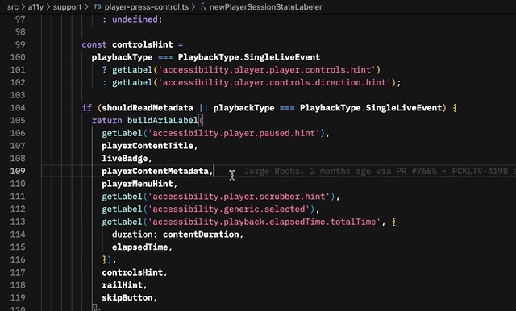
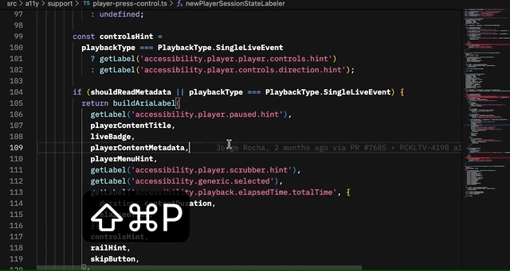

# Peacock Labels

This extension allows you to easily see label values and translations in your code editor without having to build and run the Peacock App, or opening up the different content management systems.

## Features

### Hover over labels for their value
In your code, you can hover over a label key and see its english or translated value in a tooltip.



### Lookup labels and their values
Lookup label keys and their values by searching for keys, or reversing search based on its value.



### Configure different environments
Configure your settings to see labels for different combinations of environments, devices, platforms, languages, territories, and providers.

## How to install extension

Download the latest release. Then run the following command, or right click and install while in Visual Studio Code.

###### Install with CLI
```
code --install-extension peacock-labels-0.0.1.vsix
```

<br /><br />
**Enjoy!**
